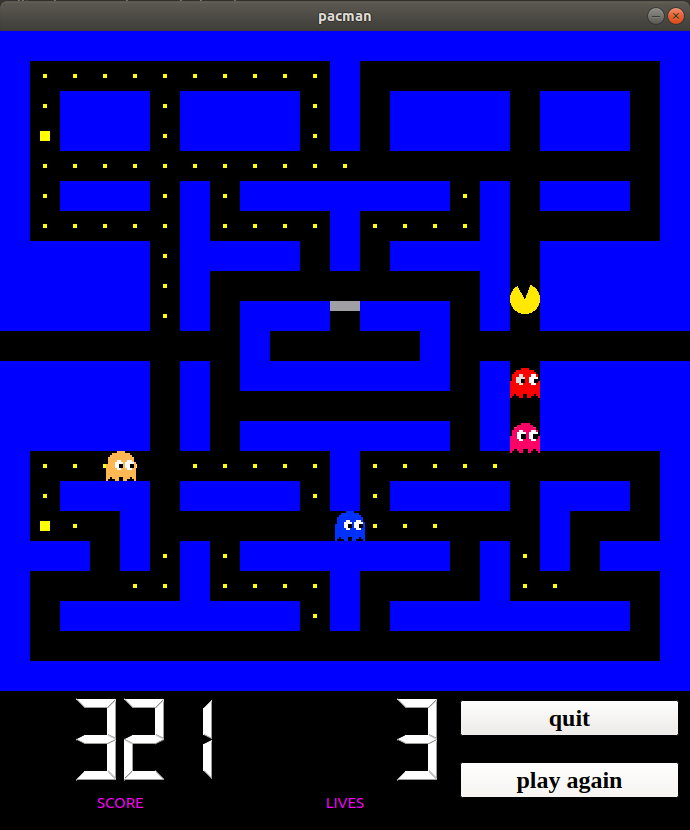
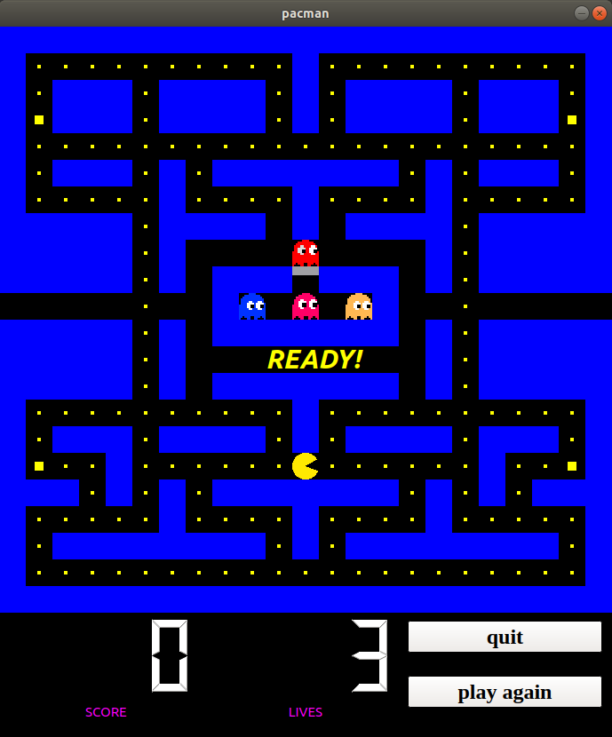
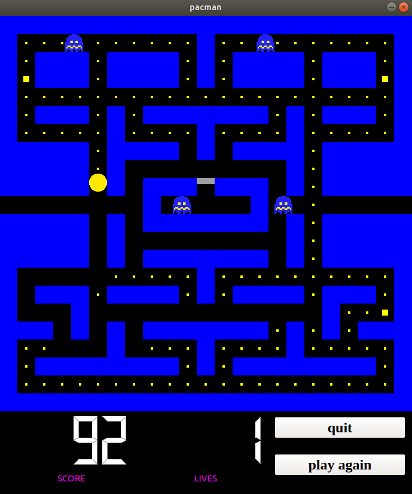

# Pacman

My version of cult game "Pacman" written in C++ with the usage of QT Library.
All the ghost are moving according to original idea (https://dev.to/code2bits/pac-man-patterns--ghost-movement-strategy-pattern-1k1a).

## Compilation on Linux

QT library is necessary.

<pre>
    <code>
        qmake -project
        qmake QT+=widgets
        make 
        ./pacman
    </code>
</pre>

## Screenshots

